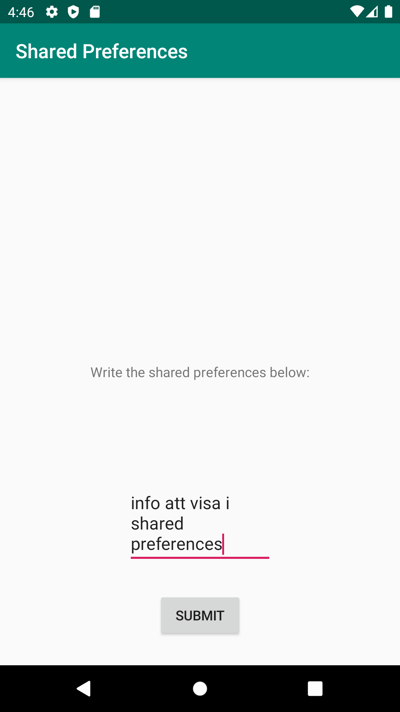
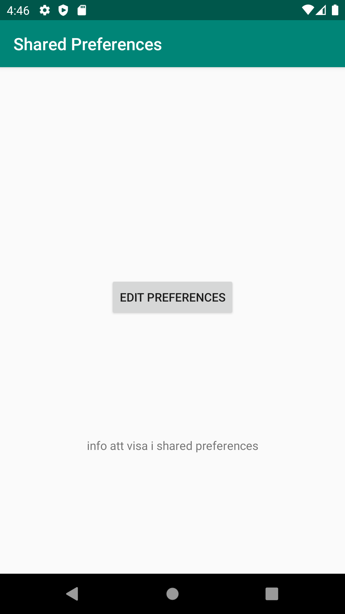

# Rapport

I denna uppgift skapades en intent för att kunna navigera till en second activity, där man skulle mata in information
som sparas i Shared preferences. När second activity stängs ska denna info hämtas i main activity och skrivas ut i en textView. Infon
hämtas i metoden onResume().


MainActivity:

```

    private SharedPreferences prefs;
    private TextView prefText;
    private Button navigateToSecondActivity;

    @Override
    protected void onCreate(Bundle savedInstanceState) {
        super.onCreate(savedInstanceState);
        setContentView(R.layout.activity_main);
        Toolbar toolbar = findViewById(R.id.toolbar);
        setSupportActionBar(toolbar);

        prefText = findViewById(R.id.prefText);
        prefs = getSharedPreferences("com.example.project", Context.MODE_PRIVATE);

        navigateToSecondActivity = findViewById(R.id.navigateToSecondActivity);
        navigateToSecondActivity.setOnClickListener(new View.OnClickListener(){
            @Override
            public void onClick(View v){
                onButtonClick();
            }
        });

    }

    protected void onResume() {
        super.onResume();
        prefText.setText(prefs.getString("text", "No pref found"));
    }

    private void onButtonClick() {
        Intent intent = new Intent(this, SecondActivity.class);
        startActivity(intent);
    }

```


Second Activity:

```
 private SharedPreferences prefs;
    private EditText editPrefsEditText;
    private SharedPreferences.Editor editPrefs;

    @Override
    protected void onCreate(Bundle savedInstanceState) {
        super.onCreate(savedInstanceState);
        setContentView(R.layout.activity_second);

        editPrefsEditText = findViewById(R.id.editPrefs);

        prefs = getSharedPreferences("com.example.project", Context.MODE_PRIVATE);
        editPrefs =  prefs.edit();
    }

    public void storePrefs(View view) {
        String prefs = editPrefsEditText.getText().toString();
        Log.d("", "onCreate: " + prefs);

        editPrefs.putString("text", prefs);
        editPrefs.commit();
        editPrefs.apply();

        this.finish();
    }

```

Bilder läggs i samma mapp som markdown-filen.

MainActivity:




SecondActivity:



